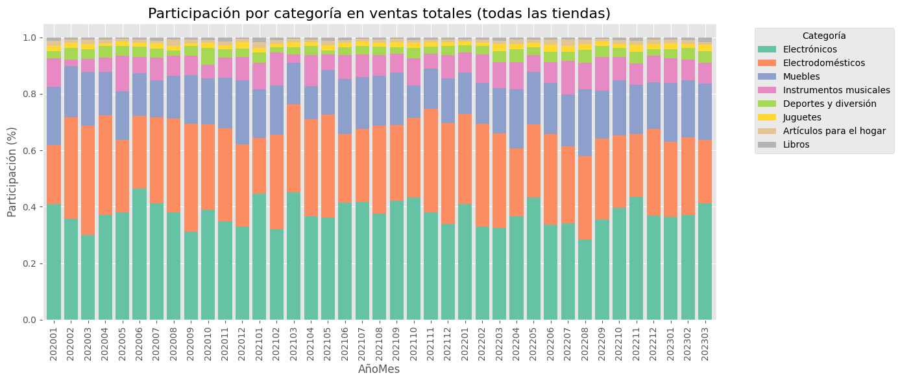

# Proyecto-DS-Challenge1
## Primer Challenge de Data Science

El propósito del presente análisis es ayudar a Don Juan a decidir cuál de sus cuatro tiendas debería vender para invertir en un nuevo negocio.

Para ello, se realizará un análisis basado en cinco aspectos clave:

- Facturación total de cada tienda: Determinar cuál tienda tiene las mayores ventas.
- Categorías más populares: Identificar qué productos se venden más en cada tienda.
- Promedio de evaluación de clientes: Evaluar la satisfacción de los clientes en cada tienda.
- Productos más y menos vendidos: Analizar cuáles son los productos que tienen mejor y peor desempeño en ventas.
- Costo promedio de envío: Calcular el costo de enviar productos desde cada tienda hasta los clientes.

## La estructura del proyecto y organización de los archivos.

- Se importaron las bases de datos y se juntaron en un solo dataframe
- Se agregaron mas campos, principalmente de fechas para poder trabajar de manera optima los informes


## Análisis Totales

Este proyecto consiste en el análisis de ventas, facturación, categorias y productos, costos de despacho e indicadores de satisfaccion de clientes. El análisis incluye la creación de una base de datos de ventas, segmentación temporal y el cálculo de indicadores clave de desempeño (KPI).

## Objetivos

- Analizar las ventas de productos por tienda y por año.
- Calcular indicadores clave como el **Ticket Promedio**, **Promedio de Calificación** y el índice **ICDT+**.
- Realizar una segmentación de los datos en trimestres y semestres para observar el desempeño a lo largo del tiempo.

## Metodología

1. **Carga de datos**: Se cargaron los datos de ventas y se realizaron las transformaciones necesarias.
2. **Normalización**: Se normalizaron los datos para crear un índice de desempeño (`ICDT+`).
3. **Análisis temporal**: Se segmentaron los datos por año, trimestre y semestre.
4. **Cálculo de KPI**: Se calcularon los indicadores clave de desempeño para evaluar el rendimiento de cada tienda.


# 📊 Informe Análisis de Ventas - ICDT+

Este informe evalúa el desempeño de las tiendas mediante un índice compuesto (ICDT+) que considera:
- Ventas en millones 💰
Se analiza desde 2020, con foco especial en el desempeño desde 2022.


## 🗓️ Ventas Anuales por Tienda (en millones COP)

| Tienda   |   2020 |   2021 |   2022 |   2023 |   Total General |
|:---------|-------:|-------:|-------:|-------:|----------------:|
| Tienda_1 | 368.93 | 362.12 | 316.57 | 103.26 |         1150.88 |
| Tienda_2 | 320.47 | 351.22 | 358.23 |  86.43 |         1116.34 |
| Tienda_3 | 321.71 | 362.95 | 350.44 |  62.92 |         1098.02 |
| Tienda_4 | 330.85 | 347.82 | 302.22 |  57.48 |         1038.38 |

## 🗓️ Ventas Trimestrales por Tienda (en millones COP)

| Trimestre  | 2023 T1 | 2022 T4 | 2022 T3 | 2022 T2 | 2022 T1 | 2021 T4 | 2021 T3 | 2021 T2 | 2021 T1 | 2020 T4 | 2020 T3 | 2020 T2 | 2020 T1 |
|------------|---------|---------|---------|---------|---------|---------|---------|---------|---------|---------|---------|---------|---------|
| **Tienda_1** | $103,26M | $72,54M | $92,16M | $72,47M | $79,40M | $77,03M | $116,32M | $81,25M | $87,52M | $69,23M | $96,46M | $98,55M | $104,70M |
| **Tienda_2** | $86,43M | $91,89M | $85,61M | $93,09M | $87,64M | $89,87M | $96,57M  | $83,67M | $81,10M | $84,12M | $78,15M | $79,17M | $79,03M  |
| **Tienda_3** | $62,92M | $87,59M | $87,88M | $85,69M | $89,28M | $133,05M| $75,57M  | $83,44M | $70,89M | $75,24M | $86,15M | $78,93M | $81,38M  |
| **Tienda_4** | $57,48M | $67,34M | $72,66M | $64,33M | $97,89M | $85,66M | $92,20M  | $77,48M | $92,48M | $75,47M | $86,33M | $98,34M | $70,71M  |

Tanto en el analisis acumulado como en detalle el orden de ingresos son Tienda_1 a Tienda_4 Descendente

### Gráfico de Venta Mensual y media de tres meses


### Gráfico de Venta Mensual y media de tres meses, tienda por tienda


# Análisis de Venta por Categoría 📦

### 📊 Ventas Totales por Categoría (2020–2023)

Las cifras están expresadas en millones de pesos colombianos (COP).

| Categoría del Producto     | 2020     | 2021     | 2022     | 2023     |
|----------------------------|----------|----------|----------|----------|
| **Electrónicos**           | $496,08M | $559,41M | $486,30M | $118,78M |
| **Electrodomésticos**      | $423,74M | $435,33M | $386,63M | $79,05M  |
| **Muebles**                | $231,40M | $227,57M | $235,76M | $62,93M  |
| **Instrumentos musicales** | $93,45M  | $111,72M | $119,38M | $24,22M  |
| **Deportes y diversión**   | $45,83M  | $39,16M  | $45,91M  | $12,07M  |
| **Juguetes**               | $21,95M  | $21,98M  | $24,18M  | $5,49M   |
| **Artículos para el hogar**| $17,85M  | $17,13M  | $18,40M  | $4,21M   |
| **Libros**                 | $11,65M  | $11,81M  | $10,90M  | $3,34M   |




Como se ve claramente, las 4 primeras categorias se llevan mas del 94% de participacion, por lo que el análisis de las otras 4 categorias es irrelevante, el mismo comportamiento ocurre cuando se análiza el ticket promedio por categoria

### 🛒 Detalle de Ventas por Categoría

Este resumen muestra las unidades vendidas, las ventas totales en pesos colombianos y el ticket promedio por categoría.

| Categoría del Producto     | Unidades Vendidas | Total Ventas (COP) | Ticket Promedio (COP) |
|----------------------------|-------------------:|--------------------:|------------------------:|
| **Electrodomésticos**      | 1,149              | $1,324,751,100      | $1,152,960              |
| **Electrónicos**           | 1,772              | $1,660,576,500      | $937,120                |
| **Instrumentos musicales** | 753                | $348,772,600        | $463,177                |
| **Muebles**                | 1,886              | $757,661,000        | $401,729                |
| **Deportes y diversión**   | 1,113              | $142,977,700        | $128,462                |
| **Artículos para el hogar**| 730                | $57,579,800         | $78,876                 |
| **Juguetes**               | 1,290              | $73,604,400         | $57,058                 |
| **Libros**                 | 742                | $37,696,100         | $50,803                 |


Nuevamente las tiendas 3 y 4 tienen los peores indicadores.

# Calificación del cliente 🌟

En este segmento se analizo la satisfaccion del cliente, y contrario a lo que se podria pensar, no necesariamente mientras mas pague por un producto, mejor será atendido.


| Tienda    | Promedio Calificación | Cantidad de Respuestas |
|-----------|-----------------------:|------------------------:|
| Tienda_3  | 4.05                   | 2,359                  |
| Tienda_2  | 4.04                   | 2,359                  |
| Tienda_4  | 4.00                   | 2,358                  |
| Tienda_1  | 3.98                   | 2,359                  |


| Categoría del Producto     | Promedio Calificación | Cantidad de Respuestas | Ticket Promedio (COP) |
|----------------------------|------------------------:|------------------------:|------------------------:|
| **Juguetes**               | 4.07                    | 1,290                   | $57,058                |
| **Muebles**                | 4.03                    | 1,886                   | $401,729               |
| **Electrodomésticos**      | 4.01                    | 1,149                   | $1,152,960             |
| **Libros**                 | 4.00                    | 742                     | $50,803                |
| **Instrumentos musicales** | 4.00                    | 753                     | $463,177               |
| **Electrónicos**           | 3.99                    | 1,772                   | $937,120               |
| **Deportes y diversión**   | 3.99                    | 1,113                   | $128,462               |
| **Artículos para el hogar**| 3.98                    | 730                     | $78,876                |

Al parecer la satisfaccion esta dada cuando uno se compra un juguete... En cuanto al comportamiento de las tiendas tienden al promedio, no hay alguna que destaque.


# Productos mas y menos vendido y su aporte a la venta

## Top mas vendidos total compañia

| Producto                   | Categoría                | Cantidad Vendida | Ticket Promedio (COP) |
|----------------------------|---------------------------|------------------:|------------------------:|
| Mesa de noche              | Muebles                   | 210              | $278,188               |
| Microondas                 | Electrodomésticos         | 206              | $561,648               |
| Carrito de control remoto | Juguetes                  | 206              | $71,688                |
| Batería                    | Instrumentos musicales     | 203              | $728,110               |
| Cama king                  | Muebles                   | 201              | $675,524               |
| Modelado predictivo        | Libros                    | 200              | $63,080                |
| Secadora de ropa           | Electrodomésticos         | 200              | $1,051,190             |
| Set de ollas               | Artículos para el hogar   | 200              | $152,532               |
| Cama box                   | Muebles                   | 199              | $523,105               |
| Bloques de construcción    | Juguetes                  | 199              | $34,181                |

# Top 10 mas Vendidos Tienda 1


## Bottom menos vendidos total compañia

| Producto                    | Categoría              | Cantidad Vendida | Ticket Promedio (COP) |
|-----------------------------|-------------------------|------------------:|------------------------:|
| Celular ABXY                | Electrónicos            | 157              | $1,005,803             |
| Auriculares con micrófono   | Electrónicos            | 158              | $143,978               |
| Mochila                     | Deportes y diversión    | 163              | $98,563                |
| Guitarra eléctrica          | Instrumentos musicales   | 165              | $784,272               |
| Ciencia de datos con Python| Libros                  | 166              | $54,434                |
| Asistente virtual           | Electrónicos            | 167              | $206,396               |
| Sillón                      | Muebles                 | 168              | $242,838               |
| Set de vasos                | Artículos para el hogar | 169              | $33,043                |
| Olla de presión             | Artículos para el hogar | 172              | $75,167                |
| Smartwatch                  | Electrónicos            | 172              | $174,010               |

# Bottom menos vendidos Tienda 1


## 🏆 Top 5 Productos por Tienda

Este resumen muestra los productos más vendidos (por cantidad) en cada tienda, junto con su categoría y ticket promedio en pesos colombianos (COP).

| Tienda    | Producto                    | Categoría                | Cantidad Vendida | Ticket Promedio (COP) |
|-----------|-----------------------------|---------------------------|------------------:|------------------------:|
| **Tienda_1** | Armario                    | Muebles                   | 60               | $491,038               |
|           | Microondas                 | Electrodomésticos         | 60               | $579,358               |
|           | TV LED UHD 4K              | Electrónicos              | 60               | $2,369,170             |
|           | Secadora de ropa           | Electrodomésticos         | 58               | $1,018,317             |
|           | Bloques de construcción    | Juguetes                  | 56               | $33,316                |
| **Tienda_2** | Iniciando en programación | Libros                    | 65               | $48,120                |
|           | Microondas                 | Electrodomésticos         | 62               | $583,742               |
|           | Batería                    | Instrumentos musicales     | 61               | $756,972               |
|           | Guitarra acústica          | Instrumentos musicales     | 58               | $321,524               |
|           | Pandereta                  | Instrumentos musicales     | 58               | $64,226                |
| **Tienda_3** | Kit de bancas              | Muebles                   | 57               | $292,979               |
|           | Cama king                  | Muebles                   | 56               | $693,477               |
|           | Mesa de comedor            | Muebles                   | 56               | $255,823               |
|           | Mesa de noche              | Muebles                   | 55               | $279,373               |
|           | Set de ollas               | Artículos para el hogar   | 55               | $158,118               |
| **Tienda_4** | Cama box                   | Muebles                   | 62               | $531,392               |
|           | Cubertería                 | Artículos para el hogar   | 59               | $44,903                |
|           | Cama king                  | Muebles                   | 56               | $670,632               |
|           | Dashboards con Power BI    | Libros                    | 56               | $35,546                |
|           | Carrito de control remoto  | Juguetes                  | 55               | $72,985                |

# Los productos mas y menos vendidos, responden al análisis de las categorias y no hay sorpresas...


# 📦 Análisis de Costos de Envío

### Por Tienda
Las tiendas mantienen un promedio de costo de envío relativamente homogéneo, con Tienda_4 siendo la más eficiente en términos de costos logísticos.

### Por Categoría de Producto
Los electrodomésticos y electrónicos tienen los costos de envío más elevados, mientras que los libros y juguetes registran los costos más bajos.


🚚 Promedio de Costo de Envío por Tienda

| Tienda    | Promedio Costo de Envío (COP) | Total de Envíos |
|-----------|-------------------------------:|-----------------:|
| Tienda_1  | $26,019                        | 2,359            |
| Tienda_2  | $25,216                        | 2,359            |
| Tienda_3  | $24,806                        | 2,359            |
| Tienda_4  | $23,459                        | 2,358            |


📦 Promedio de Costo de Envío por Categoría de Producto

| Categoría del Producto     | Promedio Costo de Envío (COP) | Total de Envíos |
|----------------------------|-------------------------------:|-----------------:|
| **Electrodomésticos**      | $61,267                        | 1,149            |
| **Electrónicos**           | $49,922                        | 1,772            |
| **Instrumentos musicales** | $24,574                        | 753              |
| **Muebles**                | $21,448                        | 1,886            |
| **Deportes y diversión**   | $6,911                         | 1,113            |
| **Artículos para el hogar**| $4,262                         | 730              |
| **Juguetes**               | $3,117                         | 1,290            |
| **Libros**                 | $2,776                         | 742              |


## El costo promedio del envio de los productos esta dentro del rango del 5 al 6 porciento del articulo, por lo tanto su comportamiento es lineal al precio.


## La tienda numero 1 es la que maneja los costos mas altos de envio, sin embargo es consecuente a su nivel de venta, lo contrario pasa con la tienda numero 4


# 📊 Indicador Compuesto ICDT+

Este indicador resume el desempeño de cada tienda con base en múltiples dimensiones clave. Cada componente tiene un peso distinto dentro del cálculo final:

- **ICDT+** = (Ventas_Totales × 0.40) + (Productos_Vendidos × 0.25) + (Calificación × 0.20) + ((1 - Costo_Envio) × 0.10) + (Ticket_Promedio × 0.05)

### Componentes:

| Variable             | ¿Qué mide?                              | Interpretación            | Peso  |
|----------------------|------------------------------------------|----------------------------|-------:|
| **Ventas_Totales**   | Total en pesos vendidos (en millones)    | 💰 Rentabilidad             | 0.40  |
| **Productos_Vendidos** | Número total de artículos vendidos       | 📦 Productividad            | 0.25  |
| **Calificación_Promedio** | Promedio de calificación (1 a 5)         | 🌟 Calidad de servicio       | 0.20  |
| **Costo_Promedio_Envio** | Costo medio de envío por tienda         | 🚚 Eficiencia logística *(menor = mejor)* | 0.10  |
| **Ticket_Promedio**  | Precio promedio por producto             | 💵 Valor por venta          | 0.05  |


- Costo promedio de envío 🚚
- Ticket promedio 💵


## Gráficos y Resultados

A continuación se presentan los gráficos y resultados clave del análisis:

### Gráfico 1: Ventas por Tienda
(img/


Componentes del Indicador ICDT+
	Variable 	Qué mide 	Interpretación 	Peso
0 	Ventas_Totales 	Total en pesos vendidos (en millones) 	💰 Rentabilidad 	0.40
1 	Productos_Vendidos 	Número total de artículos vendidos 	📦 Productividad 	0.25
2 	Calificación_Promedio 	Promedio de calificación (1 a 5) 	🌟 Calidad de servicio 	0.20
3 	Costo_Promedio_Envio 	Costo medio de envío por tienda 	🚚 Eficiencia logística 	0.10 (invertido: menor = mejor)
4 	Ticket_Promedio 	Precio promedio por producto 	💵 Valor por venta 	0.05


Este gráfico muestra el ticket promedio por tienda, lo que nos ayuda a evaluar el valor medio de cada compra.

### Tabla 1: Resumen de Indicadores de Desempeño

| Tienda  | Año  | Total Ventas | Productos Vendidos | Calificación Promedio | Ticket Promedio | ICDT+ |
|---------|------|--------------|--------------------|-----------------------|-----------------|-------|
| Tienda 1 | 2021 | $500,000     | 250                | 4.2                   | $100            | 0.87  |
| Tienda 2 | 2021 | $400,000     | 200                | 3.8                   | $90             | 0.75  |

### Conclusiones

- **Tienda 1** mostró un mejor desempeño en términos de ventas y calificación promedio, lo que se refleja en un índice **ICDT+** más alto.
- Las tiendas en general tienen un buen desempeño, pero se observa que el **Ticket Promedio** podría aumentar para mejorar el desempeño global.
Instrucciones para ejecutar el notebook

## Instrucciones para Ejecutar el Proyecto

1. Clona este repositorio en tu máquina local:
   ```bash
   git clone https://github.com/tu_usuario/tu_repositorio.git

